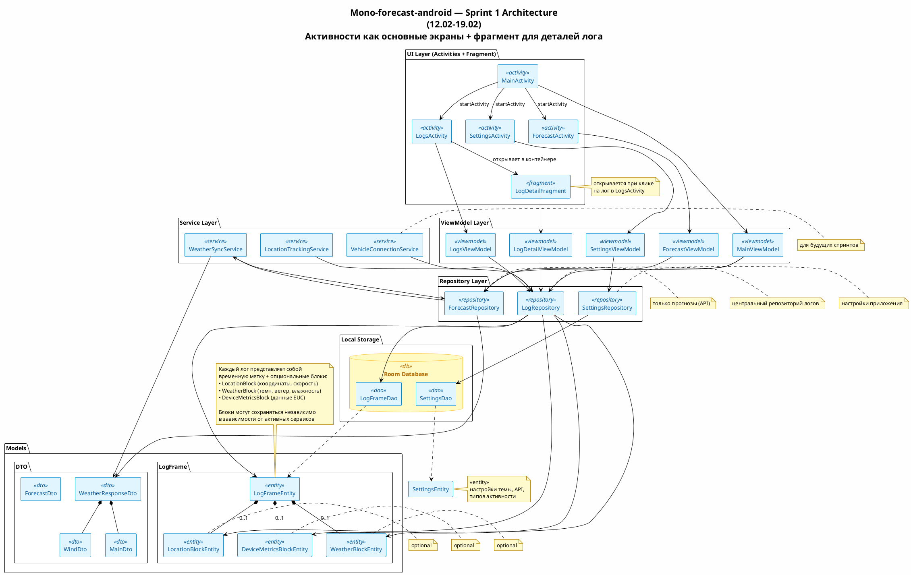

# Mono-forecast-android
Mono forecast is an android app to predict weather for EUC, motocycle and bike riders. It is also supposed to be able track your location and connect some EUCs like [Wheellog](https://github.com/Wheellog/Wheellog.Android).

# Functions overview
* App gets forecast from public API and visualise it in the app
* App analyzes forecasts and calculates the level of difficulty for activities
* Custom view style is controled with settings
* App can track your location if you need it. Weather data will also be tracked with your location
* App can automaticly define your location using GNSS systems the location also can be provided by user
* You can view your saved tracks in the app or export it and open wuth another device

# Development

## Sprint 2 (19.02 to 26.02)

### Result

* Logs page must contain brief labels of saved log files as a list with small data (mocked). Ref: 
  

* WeatherUpdateService must run correctly and should be mocked with random temperature updates one time per second.

## Sprint 1 (12.02 to 19.02)

### Result

* 3 or 4 screen application with following pages: Main page, Settings page, Forecast page and (optional) Log page. - DONE
* Main page must contain: header (with page label and settings button), 4 sqare sections lower (Forecast with cloud/sun/etc icon, Bluetooth connect with BLE symbol icon, Location with standart point-on-map icon, logs page with some icon) square icons are supposed to use Fragments. Ref: 

- DONE

* Settings page must contain: header (with page label and settings button), "use system theme" checkbox, light|dark theme switch (disabled if checkbox is marked), API dropout choice list, activity dropout choice list (EUC, Bike, Motorcycle, etc). Theme is supposed to change as soon as switch is clicked by user. Ref: 
  

-DONE (with minor differences)

* Forecast page must contain: header (with page label and settings button), weather icon, temperature, wind, humidity, etc data (mocked).
* Logs page must contain brief labels of saved log files as a list with small data (mocked). Ref: 
  

- NOT DONE

* Services should be used somehow in the app :)
- NOT DONE

### Done

All except:
* Fragments usage in Logs page.
* Correct Logs page content
* Background service correct work without exception

### Tools to use
* only Kotlin
* only [XML](https://developer.android.com/develop/ui/views/layout/declaring-layout?hl=ru)
* [retrofit](https://developer.android.com/codelabs/basic-android-kotlin-compose-getting-data-internet#0) 2 or/and [okhttp](https://habr.com/ru/articles/717900/)

### Sources
[Youtube](https://www.youtube.com/playlist?list=PLgPRahgE-GctUcLMcQFvl00xsXqpNJOix) 

### UML architecture

Build:

Source:

